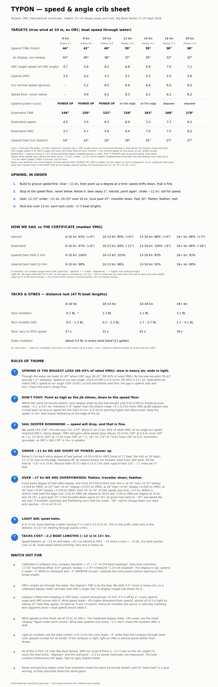
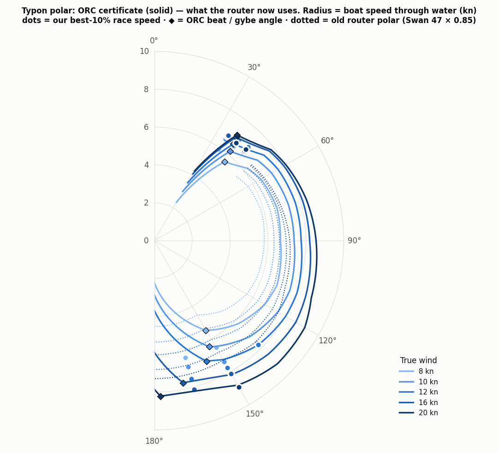
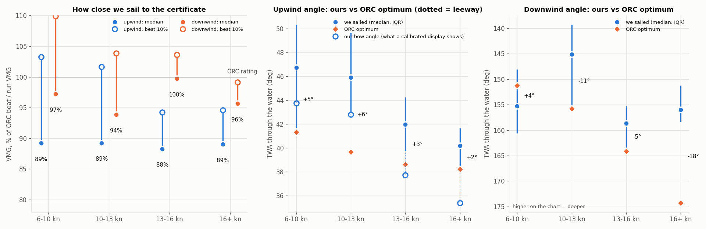
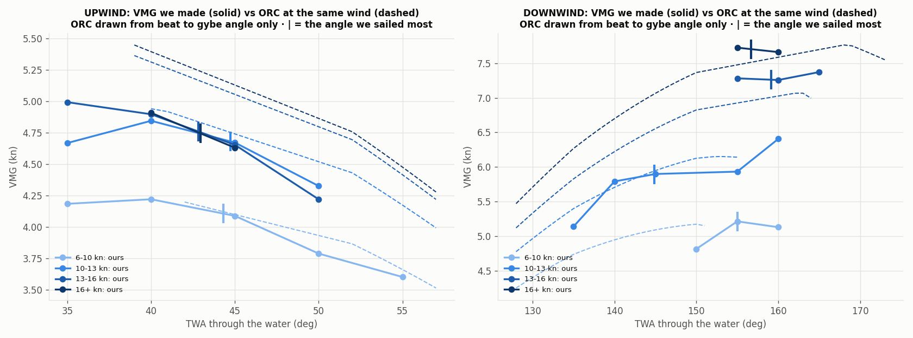
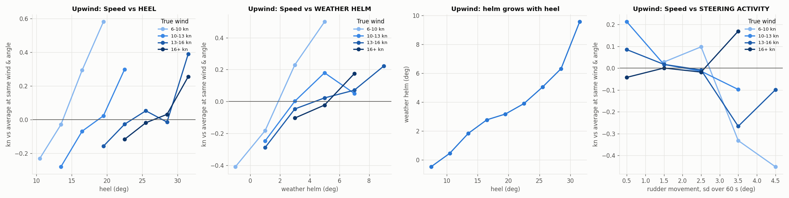

# Typon's polar, and how we sail against it

**The router uses Typon's ORC International certificate.** The NMEA logs don't set the polar. They
measure how close we sail to it. `tools/build_polar.py` does both jobs:

```bash
python3 tools/build_polar.py              # analyse the logs -> charts in docs/polar/
python3 tools/build_polar.py --write-js   # ...and write the ORC table into router.js + route-worker.js
python3 tools/build_polar.py --cache      # skip re-parsing (tools/polar_out/grid.pkl)
```

New regatta: add its windows to `RACES` in the script and re-run.



---

## 1. The router polar

| | Before (to Sept 2026) | Now |
|---|---|---|
| Source | Generic Swan 47 table × 85% | Typon's ORC International certificate |
| Upwind | **Nothing below 52° TWA**: the beat row was never copied | Cert beat angles (38–47°) and beat VMG |
| Downwind | Clamped at 150° | Cert gybe angles (141–178°) and run VMG |
| Performance slider default | 85% | 95%, set when race sailing measured 96% of rated VMG. **Since the leeway and wind-height corrections (§2) upwind is 88–93% VMG (88% in 13+ kn), downwind 94–100%: not yet revisited** |

The cert's fixed-angle rows (52–150°) are used as they are. Between the beat angle and 52°, and
between 150° and the gybe angle, **VMG** is interpolated rather than speed, so the cert's optimum
angles stay the optimum. Outside those angles speed falls off at 5% per degree of pinching and 2%
per degree past the gybe angle. The cert has no data there; those two rates are ours, chosen only
so that VMG falls away from the optimum. The grid is 2° close-hauled and 3° deep because a coarser
grid clipped the 16 kn gybe peak by 2%. `tests/test_physics.mjs` checks that the router's best VMG
lands on the cert's beat and gybe angle at 8, 12 and 16 kn, and that the two JS copies of the table
are identical.

The `falloff` route variant is now a no-op. It discounts only beyond the table's last TWA, and the
table now reaches 180°.



---

## 2. The data behind the performance numbers

| | |
|---|---|
| Recordings | 84 files, 13–22 Sept 2026. **Racing: Big Boat Series 17–20 Sept** |
| Race windows | Start = the turn upwind after the pre-start circling. Finish = head-to-wind as the sails come down. All four finishes are within 0.2 nm of each other, off the St. Francis race deck |
| Used | Beats (TWA ≤ 55°) and runs (≥ 130°) only. The courses were windward–leeward, so anything in between is a rounding. Steady 60 s stretches, 60 s averages: **5.8 h** |
| Excluded | Motoring, pre-start jogging, the delivery sail, reaching, manoeuvres |

### Calibration (fitted from the data on every run)

| Channel | Finding | Effect |
|---|---|---|
| Paddlewheel | Reads 0–5% low (k = 1.00–1.05 per day), fitted against GPS with current removed | corrected |
| Compass deviation | Fitted from 0.9 h of upright sailing (heel under 4°, so no leeway): compass heading vs GPS track, current held constant per 10 min, as a 2nd-order curve. **−4.3° on the ~198° beat heading, +0.9° on ~273°.** Half that difference, 2.6° per side, would otherwise read as leeway. Thin data: ±1–2° | corrected before everything else |
| Masthead heel | A heeled vane turns in the tilted plane and sees the sideways wind × cos(heel), so it reads **narrow**: ~1° of AWA at 25° heel | corrected per sample. Needs the heel sensor; samples without one are dropped, not left uncorrected |
| Leeway | **leeway = 2.75° × (heel/20)^2.25 × (6.5/STW)²** (refit 2026-09-25; was 7.5 × heel/STW², linear, and 0.5–2° short above 26° heel). Per heel range, fitted without the formula: 1.5° below 20°, 3.0° at 20–23°, 4.5° at 23–26°, 5.0° at 26–28°, 6.0° at 28–30°, 7.25° at 30–34° (±0.5°); the formula matches within 0.2° above 20°. Below 15° two fits disagree (0.5° from the formula, 1.5° per range), so light-air upwind % carries ±2 points. Each extra degree of heel adds ~0.33° leeway at 20°, 0.43° at 25°, 0.50° at 28°, 0.54° at 30° (−0.024 to −0.039 kn VMG), while speed rises only ~0.2 kn from 20° to 34°. Fitted from heading vs GPS track in 46 upwind windows that contain both tacks, current held constant per 10 min. Current is solved as an unknown per window, so anything that is the same on both tacks (paddlewheel scale, a fixed compass offset) goes into it; only an error that flips with the tack can pass for leeway. Compass deviation was one, and is now removed. Imperfect tilt compensation in the heading sensor would be another, and the logs can't separate it | corrected: **TWA is now through the water**, as ORC's angles are |
| Masthead angle | **+3.25° offset** plus **4.0° upwash**, from 72 tacks. Raw data showed 45° vs 34° TWA by tack and a 7° TWD jump on every tack | corrected in software. **The instrument display is still raw**: upwind it reads ~7° wide on starboard and ~2° narrow on port (by the bow) |
| Wind height | ORC's wind speeds are at 10 m (per ORC's speed guide; not checked against the VPP documentation). Our masthead is ~20.3 m up: cert BAS 1.55 + P 16.97 + ~0.5 m, plus ~1.3 m freeboard (estimate). Over-water profile, exponent 0.11: masthead wind × 0.925 (1/7 would give × 0.904) | corrected. Before it, every ORC target we compared against was for too much wind: light-air VMG read 84% instead of 89% |
| Masthead speed | TWS reads **~6% higher downwind than upwind** (80% range 3–9%), from 9 beat→run and 7 run→beat roundings: an instrument error flips sign between the two, a building breeze doesn't, and the breeze explains only ~1% (2026-09-25). **Not heel:** it is ~13% under 15° heel, 7% at 15–22°, ~0 above 22°, so it is a light-air effect (likely the cups reading a few % low, or sail-induced flow at the masthead). Heavy-air numbers are unaffected; light-air upwind % could be ~5 points lower (if downwind is right) or light-air downwind ~5 higher (if upwind is right). Settle it with a calm-day motoring test (apparent wind = boat speed) or a shore station. Heel also lowers the masthead (18.4 m at 25°, ~1% less wind; not corrected) | not corrected: light air ±10%, breeze ±3% |
| Wind feed | Updates every **5.2 s**, ~2 s behind the compass | steady-state filter; manoeuvres excluded |
| Rudder | Zero offset +1.7°; typical upwind weather helm 3.6° | corrected |
| Heel | ~1° asymmetry between tacks | none |

The heading sensor is a 10 Hz attitude unit ($HCHDG heading, $TIROT rate of turn and $YXXDR
yaw/pitch/roll together, yaw = heading), probably the autopilot's, so it should be tilt-compensated.

**Compass errors move the split, not the total.** The track through the water is tied to GPS. A
compass error changes how much of it we call "bow angle" and how much "leeway", but not the sum.
The deviation correction moved 16+ kn from 34° bow + 7° leeway to 36° + 5°; the track stayed at
41° and VMG moved by under 1 point.

**The vane is pinned to the compass.** "No TWD jump on a tack" means the heading change through a
tack equals the two bow angles added together, so the fitted upwash forces the vane's bow angle to
agree with the compass on average. The script prints the check every run: half the compass tack
angle plus leeway, against the vane. In 13+ kn they agree within 2°. **In 6–13 kn the vane reads
~4.5° wider than the compass**, because one upwash number serves all wind speeds. If the compass is
right there, light-air VMG is several points better than shown below.

**Current is not an independent measurement.** It is the window average of GPS velocity minus
water velocity, so it comes from the same sensors. With that caveat, heavy-heel leeway came out the
same in windows with weak current, strong current (~1 kn) and current running against us.

**Accuracy:** speed ±0.3 kn, angles ±2°, **plus the leeway fit** in heavy air and **the upwash**
in light air. A 2° error in either moves every upwind angle 2° and upwind VMG ~2.5%.

---

## 3. How we sail against the certificate



All angles here are **through the water**, the way ORC's are. For the bow angle, subtract the
leeway row. All wind speeds are **at 10 m**, ORC's reference (§2); the masthead display reads ~8%
more.

Why through the water: ORC's description of its VPP balances drive against drag "along the yacht's
track (its direction of motion)", and its boat model takes only speed, heel, reef and flat as
inputs. There is no heading in the model, so its wind angles can only be relative to the track.
That is inferred from the model's structure, not a quoted definition. The same structure means
ORC has no leeway angle to compare ours with: side force appears only as induced drag.

| Upwind | 6–10 kn | 10–13 | 13–16 | 16+ |
|---|---|---|---|---|
| Median VMG, % of ORC | 93% (91–93) | 90% | 88% | 88% |
| Our angle (ORC) | 45° (41°) | 45° (40°) | 42° (39°) | 41° (38°) |
| Our leeway | 1.4° | 2.3° | 4.2° | 5.3° |
| Our angle by the bow | 43° | 43° | 38° | 36° |
| Speed, % of ORC at our angle | 101% | 96% | 92% | 90% |

| Downwind | 6–10 kn | 10–13 | 13–16 | 16+ |
|---|---|---|---|---|
| Median VMG, % of ORC | 97% | **94%** | 100% | 96% |
| Our angle (ORC) | 155° (151°) | **145° (156°)** | 159° (164°) | **156° (174°)** |

- **Upwind is the bigger loss: 88% of rated VMG in 13+ kn, 90% in 10–13, ~91–93% in light air**
  (since the 2026-09-25 leeway refit; before it, 88–89% in every band). Our best 10% of moments
  reach 93–107%, so the boat can get there; holding it is the gap.
- **What we can sustain.** Best VMG held as a rolling mean (the crib sheet's "best held" rows):

  | Held for | 6–10 kn | 10–13 | 13–16 | 16+ |
  |---|---|---|---|---|
  | 5 min | 106% | 103% | 93% | 93% |
  | 10 min | 98% | 96% | 92% | 90% |

  No run at 95%+ lasted 3 minutes, but 16 of the 18 one-minute-plus runs had steady wind and
  steady or rising speed, and most were 0–6° *wider* than ORC. So they were real speed, not lulls,
  coasting or pinching. Light air: ORC is reachable for 5 minutes, and the gap is consistency.
  13+ kn: ~93% is the ceiling with these sails and this trim. The light-air figures are the least
  certain: ORC's target rises fast with wind there, so a 10% wind error moves them ~7 points,
  against ~1 point in 16+.
- **Light air: mostly angle.** Speed at our own angle is 95–96% of ORC's, but we sail 5–6°
  wider. 1° ≈ 1–1.5% of VMG, so the angle is most of the gap below 13 kn.
- **Heavy air: mostly speed.** 91–92% of ORC's speed at our own angle (6.4 kn where ORC says 7.0),
  and only 2–3° wider. Downwind, at our own angle, we match ORC (100–104%). Hull, bottom and weight
  would slow both directions; upwind sails and trim slow only upwind.
- **Downwind: angle only, and only in two bands.** 13–16 kn is at ORC already. 10–13 kn (11° too
  high) and 16+ (18° too high) are the gains.
- **Best VMG sits near ORC's angle.** VMG by angle relative to ORC (each moment against ORC at its
  own wind; median; cells with under 3 minutes are in brackets):

  | vs ORC angle | 3°+ narrower | 0–3° narrower | 0–3° wider | 3–6° wider | 6–9° wider | 9°+ wider |
  |---|---|---|---|---|---|---|
  | 6–10 kn | 87% | 89% | **95%** | 91% | 87% | 86% |
  | 10–13 kn | (94%) | 96% | **99%** | 94% | 89% | 82% |
  | 13–16 kn | (92%) | **91%** | 90% | 88% | 85% | 78% |
  | 16+ kn | (96%) | **92%** | 89% | 87% | (84%) | (77%) |

  This table compares moments across all conditions, so wind strength and sea state leak in. The
  within-stretch test below holds them fixed.

### Point higher, or foot?

Moments are compared **inside the same 10-minute stretch on the same tack** (at least 3 minutes of
it), against that stretch's median bow angle. That holds wind strength, tide and sea state roughly
fixed. 60 s averages.

| Per degree wider by the bow | 6–10 kn | 10–13 | 13–16 | 16+ |
|---|---|---|---|---|
| Speed gained | +0.06 kn | +0.03 kn | +0.05 kn | +0.02 kn |
| Speed needed to break even | ~0.09 kn | ~0.12 kn | ~0.10 kn | ~0.10 kn |
| VMG | −0.02 kn | −0.05 kn | −0.03 kn | −0.05 kn |

| 2–4° higher than the stretch | 6–10 kn | 10–13 | 13–16 | 16+ |
|---|---|---|---|---|
| VMG vs the stretch | +0.03 kn | **+0.13 kn** | **+0.14 kn** | **+0.16 kn** |
| Wind in those moments | ±0.1 kn | +0.1–0.2 kn | +0.2–0.3 kn | +0.6–1.0 kn |

- **Footing loses.** Each degree wider bought a third to a half of the speed it needs.
- **Pointing higher, within what the boat sails, gained in 10+ kn.** Part of that is puffs: we
  point up when the wind builds. By ORC's slope that is a small part (≤0.05 kn) in every band. In
  6–10 kn pointing higher was about even.
- **What this can't say:** how high is too high. These moments are the ones the helm chose, inside
  the range the jib allowed. Nothing here tests pinching past the jib's edge, and 60 s averages don't
  capture speed bleeding off over several minutes. Leeway barely changed with bow angle within a
  stretch, but the leeway formula only responds to heel and speed, so that isn't independent
  evidence.
- **So:** don't foot for speed. In 10+ kn, sit on the high edge of the groove, feathering in 16+.
- **The speed floor.** Split by how much speed the high moments lost: under 0.1 kn, VMG rose
  0.16–0.22 kn; at 0.3–0.45 kn it was about even; past 0.45 kn it fell 0.11–0.19. The crib
  sheet's "speed floor" row is our normal-groove speed at each wind minus 0.3 kn. Above 0.2 kn lost
  there's under a minute of 16+ kn data, so the heavy-air floor borrows from 10–16 kn.

**Downwind, same test.** 70 minutes in 13 stretches, thinner than upwind. Per degree deeper, VMG
rose 0.02 kn in 10–13 kn, 0.01 in 13–16 and 0.05 in 16+; in 6–10 kn, where we're already deeper
than ORC, it fell 0.01. In 16+ kn the deepest moments also had 1.8–2.5 kn more wind (we go deep in
puffs), so part of that gain is the puff.



### Tacks and gybes (race windows)

| | 6–10 kn | 10–13 kn | 13–16 kn | 16+ kn |
|---|---|---|---|---|
| Tack: distance lost | ~0 (unreliable) | 17 m (1.2 BL) | **26 m (1.8 BL)** | **34 m (2.4 BL)** |
| Tack: middle half | −0.8 to 0.7 BL | 0.8 to 2.4 BL | 0.3 to 2.3 BL | 2.0 to 3.8 BL |
| Tack: seconds to 95% speed | 27 | 36 | 36 | 42 |
| Gybe: distance lost | 5 m | 6 m | 9 m | 7 m (≈0.5 BL throughout) |

BL = 47 ft (14.3 m) boat lengths. In 13+ kn, speed bottoms at ~3.6 kn from 6.5. With ~15 tacks a
race that's ~33 BL, about 2.5 minutes; our best quarter of heavy-air tacks cost ≤ 2 BL. Tack loss is
measured against the wind axis, so it moved when the calibration did (13–16 kn has read 2.6, 1.6
and 1.8 BL). Treat these as ±1 BL. The light-air figure is unreliable: shifts move the axis too.

---

## 4. Heel, helm and steering



Every comparison below holds wind speed (1 kn) and TWA (5°) fixed. The 5 s wind update still lets
part of a gust leak into "more heel" and "more helm", so treat these as strong hints, not proof.

- **Heel: more meant more boat speed in every upwind band**, with no point where extra heel starts
  costing speed (data runs to ~30°). Heel in our faster moments: ~13° in 6–10 kn, ~18° in 10–13,
  ~23° in 13–16, ~26° in 16+. This is speed through the water, not VMG. More heel also means more
  leeway (§2), so in heavy air extra heel is **not** shown to help VMG. Downwind, heel made no clear
  difference in race data.
- **Weather helm: 3–6° was fast; neutral (0–2°) was 0.15–0.3 kn slow in 6–16 kn.** Neutral helm is
  mostly a light-air thing (34 min in 6–10 kn, 9 in 13–16, 1 in 16+), so **there is no evidence
  about neutral helm in 16+ kn**. Within a band, the neutral moments did not have lighter wind
  (within 0.8 kn). The stricter test inside the same 10-minute stretch, with wind, angle and heel
  fixed, gives a smaller effect: +0.03 to +0.13 kn per degree. It is solid in 10–13 kn and 16+,
  where helm only varied ±1° within the normal 3–9° range. Helm grows ~1° per 4° of heel. Above
  8° there are too few minutes to say.
- **Steering activity:** in 6–13 kn, busy steering (rudder moving 3°+ over a minute) cost
  0.15–0.25 kn. In 13+ kn, steering through waves made no difference.
- **Depowering: only partly tested.** The logs have no sheet or traveller data. In 6–16 kn,
  neutral-helm moments were slow. In 16+ kn, where depowering matters, we never eased to neutral,
  so the logs can't say whether it would hurt. What we sailed in 16+ was a feathering mode
  with 4–6° of helm (88% of rated VMG). Traveller, flattening and feathering is sound practice,
  but it isn't proven against easing the main.

### Power: when we were short of it, and how much heel is too much

VMG gained per extra degree of heel, inside the same 10-minute stretch (so part of "more heel" is
a gust arriving; the direction across bands is the solid part, not the size). 10 m wind:

| True wind | 6–9 kn | 9–11 | 11–13 | 13–15 | 15–17 | 17+ |
|---|---|---|---|---|---|---|
| Typical heel | 12° | 17° | 19° | 23° | 25° | 27° |
| VMG per extra degree of heel | **+0.08** | **+0.05** | +0.01 | +0.02 | 0.00 | **−0.04** |

- **Short of power below ~11 kn.** That was most of 17 Sept (7–10 kn) and the lulls on 20 Sept
  (10–13 kn). Helm there was only ~1.5°.
- **On the edge at 11–17 kn, overpowered above 17.**
- **No sharp heel ceiling; every degree past ~20° costs a little more** (refit 2026-09-25: leeway
  rises steadily, ~0.45° per degree of heel, see §2 for the numbers). Aim 20–25° in 16+ kn; a gust
  past 25° is the traveller-down signal (in 16+ kn gusts heel reached ~30° and speed did not rise).
  28° is where the loss becomes obvious, not where it starts. The earlier reading: in 16–19 kn, VMG went 91% → 89% → 88% → 86% of ORC across 22–24°,
  24–26°, 26–28° and 28–30° of heel; within a stretch, moments past 28° made 0.07 kn less VMG
  despite 0.8 kn more wind. In 13–16 kn there was no clear ceiling up to 30°. Leeway and track
  angle both grow with heel (16–19 kn: 37° track at 22–24° heel, 43° at 28–30°).
- **Reefing:** race wind never passed ~21 kn at 10 m, so the logs can't give a reef point. The
  measured rule is: if traveller, backstay and feathering can't hold heel under ~28°, you're past
  the useful range of the sail plan.
- **ORC's own heel is unknown.** The VPP solves for heel (heeling = righting moment) and depowers
  optimally, but the one-page certificate doesn't publish the heel it chose. Our data shows VMG flat
  from 20° to 28°, so there's no evidence that sailing flatter would pay. The ORC Speed Guide for
  Typon may list target heel (unconfirmed), which would settle it.
- **Crew weight.** All of this is 14 crew. With the usual 8, ~0.5 t less on the rail: the same
  heel arrives at roughly 8–10% less wind (heeling force grows with wind speed squared), so
  "depower" and the ceiling come ~1–2 kn earlier. That is an estimate, not a measurement. ORC's
  targets assume the certificate's declared crew weight.
- **Bigger jib?** Not shown. The certificate already rates a ~108% jib (HLP 6.52 / J 6.03), so
  ORC's targets assume it; the light-air gap at 10 m is mostly angle (speed is 95–96% of ORC at our
  angle); and 57% of upwind race time was 13+ kn. Power-up trim with the current sails comes first.
- **The heavy-air gap is upwind only.** At our own angle we make 100–104% of ORC's speed downwind
  and 91–92% upwind in 13+ kn. The logs have no sail-shape data, so they can't choose between main
  and jib; a deep dacron main fits the heavy-air heel and the pointing limit.

---

## 5. Corrections to earlier conclusions

These were stated in an earlier draft and are wrong:

- **"Heel ceiling 28°" and "88–89% upwind in every band".** Leeway was modelled as linear in heel
  (7.5 × heel/STW²). Fitted per heel range it steepens: too much below 20° of heel, 0.5–2° too
  little above 26°. With the refit, light-air upwind is 91–93% rather than 88–89%, heavy air stays
  at 88%, and there is no knee at 28°: each extra degree of heel costs a little more than the last.

- **"We sail 31–35° in heavy air, higher than ORC's 38°, at 97–98% of rated VMG."** That compared
  our angle by the bow with ORC's angle through the water, and computed VMG along the bow. With
  leeway (§2) our track is 41–44° in 13+ kn and VMG is 86–88%. The same correction moves every
  upwind band from 93–98% to 84–88%. The first suspicion was the vane reading narrow at heel. That
  is real but worth only ~1° of AWA, and the calibration had already pinned the vane to the compass.
- **"Upwind 84–88%, light air worst."** Before the 10 m wind correction, ORC's targets were for
  ~8% too much wind. At 10 m, upwind is 88–89% in every band and downwind 94–100% (88–93% after the
  leeway refit, first bullet).
- **"We slide 7° in heavy air."** An intermediate version, before the compass deviation fit. 2.6°
  per side of that was deviation between the two beat headings; leeway is ~5°, the bow angle ~36°.
  VMG and the track angle didn't change.
- **"Build speed, don't pinch."** Also from that version, inferred from the leeway formula. The
  within-stretch test (§3) says the opposite: footing loses, and pointing higher within what the
  boat sails gained.
- **"Upwind 6–13 kn: 98–106% of rated VMG near ORC's angle."** Still the best angle, but 88–97%,
  and we are wider than ORC's angle 76–88% of the time, not ~60%.
- **"In 6–10 kn footing is free."** It came from a weak within-stretch test; the larger comparison
  shows VMG falling as we go wider than ORC.
- **"Light air is our weak regime (82–85%)."** That was against our own best-10% speeds, which are
  inflated in light air by lulls and the 5 s wind lag. Against the cert all upwind bands are
  within 1 point of each other (88–89%).
- **"Downwind is our strong side."** Against the cert it's 94–100%, and the loss is angle. Upwind
  (88–89%) is weaker.
- **"We underperform the rating in heavy air."** That compared Swan-filled table cells, not
  measurements. Measured heavy-air VMG is 88–89% of ORC, mostly speed (91–92%).
- **"More heel downwind in 13+ kn costs ~1 kn."** That came from all sailing, including cruising and
  motoring. In race data there's no clear effect.

---

## 6. Race review: Saturday 19 Sept (ORC D, strong wind)

`tools/race_review.py` splits a race into legs and benchmarks each against ORC **for the leg that
had to be sailed**: the rhumb line through the water, rounding to rounding, and its angle to the
wind. Inside ORC's beat or gybe angle ORC tacks or gybes at its optimum; outside it, ORC reaches
straight there. That matters here: a mark that isn't dead downwind (the race-deck finish under the
Gate, 141° off the wind) is a reach, and sailing it at 141° is the course, not "too high". The
§3 downwind angle figures assume every run is dead downwind, so on this kind of course they
overstate the angle loss. With `--rival`, it times competitors that transmit AIS between our
rounding points.

```bash
python3 tools/race_review.py 2026-09-19 12:00:00 12:47:06 --handicap 0.9243 --rival WOWLA=338521423:0.9039:12:43:33 \
    --rival FEATHER=0:0.9043:12:41:46 --rival JARLEN=0:0.9302:12:43:00 --rival "FINAL FINAL=0:0.8805:12:46:24"
python3 tools/race_review.py 2026-09-19 13:00:00 15:35:42 --handicap 1.0129 --rival WOWLA=338521423:0.9657:15:36:46 \
    --rival FEATHER=0:0.963:15:24:47 --rival JARLEN=0:0.9994:15:29:04 --rival "FINAL FINAL=0:0.9414:15:42:29"
```

**Results (ORC, time-on-time, 7 boats).** R4 (12:00, W/L medium, handicap 0.9243): 7th, +5:46
corrected on the winner. R5 (13:00, W/L 60-40 med/high, 1.0129): 6th, +18:17. ORC rates Typon at
about J/35 pace (Jarlen 0.930 / 0.999). Fleet: Feather (J/100), Tangaroa (J/109), Wowla (J/100),
Jarlen (J/35), Final Final (First 30), Frequent Flyer (Farr 30).

**Against ORC, by leg:**

| Race | Leg | Rhumb to wind | Benchmark | Sailed | ORC | Lost | % of ORC |
|---|---|---|---|---|---|---|---|
| R4 | 1 up | 7° | beat | 14.2 min | 12.0 | 2.2 | 84% |
| R4 | 2 down | 171° | run | 8.9 | 7.7 | 1.2 | 87% |
| R4 | 3 up | 0° | beat | 13.5 | 10.8 | 2.6 | 80% |
| R4 | 4 down | 170° | run | 10.5 | 7.9 | 2.6 | 75% |
| R5 | 1 up | 16° | beat | 53.2 | 47.4 | 5.7 | 89% |
| R5 | 2 down | 165° | reach | 27.3 | 27.3 | 0.0 | 100% |
| R5 | 3 up | 21° | beat | 60.4 | 53.9 | 6.5 | 89% |
| R5 | 4 down | 141° | reach (finish) | 14.9 | 14.3 | 0.5 | 96% |

R4: 81% of ORC overall, weak on every leg. R5: 92%, and 12.2 of the 12.8 minutes lost were upwind.

**Against Wowla (J/100), corrected:** R4 +0.8 / +1.4 / +2.0 min (the last two legs merged: no AIS
at Wowla's third rounding), total +4.2 (results +4:10). R5 +1.7 up, +2.1 down, **−0.9 up**,
+3.4 on the final reach; total +6.3 (results +6:20). The leg sums reproduce the scoreboard, which
validates the method.

**Did they sail better, or rate better?** With the rivals' certificates (Wowla, Feather, Jarlen,
Final Final, in `race_review.py`'s `CERTS`), each boat's ORC time for the course comes from our
legs (same marks, same wind) and its elapsed time from the results, so this works without their
AIS. "Rating" is the corrected gap if every boat sailed exactly at its own polar; "sailing" is the
rest. The corrected gaps reproduce the official results to within seconds.

| Race | Typon, % of own polar | Feather | Wowla | Jarlen | Final Final | Gap to Feather = rating + sailing |
|---|---|---|---|---|---|---|
| R4 | 82% | **96%** | 92% | 91% | 89% | +5.8 = −0.9 + **6.6** min |
| R5 | 92% | **102%** | 94% | 96% | 93% | +18.3 = +2.7 + **15.6** min |

- **They sailed better.** Every rival sailed closer to its own polar than we did in both races.
  The rating was worth at most 2.7 min against us (R5: the J/100s and the First 30 benefit from a
  windy course with a reach finish, scored as windward/leeward), and in R4 it favoured *us* by
  ~0.8 min. The winner, Feather, sailed at 96–102% of its polar.
- **Downwind against Wowla:** Wowla sailed at 105–107% of its own polar on R5's run and final
  reach, where we were at 96–100% of ours. That's their sailing (+1.7 and +1.1 min), with the
  rating adding +0.5 and +2.3 min. An earlier version of this section called most of it the rating;
  it isn't.
- **"Sailing" includes tactics.** A rival's percentage uses our wind and our rhumb lines. A boat
  on a better side or in more pressure scores above 100% (Feather's 102% in R5). So "sailing" means
  speed, trim, tactics and luck together, for both boats.

**Could we have won by sailing better?** Our corrected time at X% of our polar is ORC time ×
handicap / X (R4: 38.4 min × 0.9243; R5: 143.0 × 1.0129), placed against the fleet's actual
corrected times:

| Typon, % of own polar | R4 | R5 |
|---|---|---|
| actual (82% / 92%) | 7th | 6th |
| 90% | 4th | 6th |
| 93% (our sustained heavy-air best) | 3rd | 5th |
| 94% | 1st (tie with Feather) | 5th |
| 98% | 1st | 3rd |
| 104% | 1st | 1st |

In a moderate windward/leeward race the rating is fair and a win is ~94% away. On a windy course
with a reach finish (R5), the rating (~1.7% against us) plus a rival sailing above its polar put
the win out of reach; a consistent 93–95% is still worth 1–4 places. Two races on one day; the
Tangaroa (J/109) and Frequent Flyer (Farr 30) certificates were added 2026-09-25. Their finishes
are transcribed for Saturday only, so their split is R4/R5 only (% of own polar, then corrected gap to
Typon = rating + sailing, + = rival ahead): Tangaroa R4 95% (+5.6 = −0.7 + 6.3), R5 100%
(+16.3 = +3.2 + 13.0); Frequent Flyer R4 88% (+2.5 = −0.8 + 3.3), R5 90% (−1.0 = +2.1 − 3.1).
Tangaroa matches the J/100s: it sails to its polar and we don't. Frequent Flyer is the one boat near
our level. Commands: `--rival TANGAROA=0:0.9193:12:41:19 --rival "FREQUENT FLYER=0:0.947:12:43:23"` (R4),
`--rival TANGAROA=0:0.9798:15:24:22 --rival "FREQUENT FLYER=0:1.0066:15:37:38"` (R5).

### The whole series (17–20 Sept)

Same method, all six races. Every boat's % of its own polar over our legs and wind. Every
corrected gap reproduces the official results.

| Race | Wind (10 m), course option | Typon | Feather | Wowla | Jarlen | Final Final | Rating vs Feather | Typon needed to win / for 3rd |
|---|---|---|---|---|---|---|---|---|
| R1 Thu 10:05 | 8–11 kn, AP low/med (3 h 40 min) | 94% | 106% | 100% | 102% | 97% | +0.3 min | 106% / 103% |
| R2 Fri 11:45 | 10–11 kn, W/L medium | 91% | 99% | 97% | 93% | 94% | +0.7 | 100% / 98% |
| R3 Fri 13:40 | 14–21 kn, W/L med/high | 86% | 102% | 92% | 96% | 93% | −0.2 | 101% / 96% |
| R4 Sat 12:00 | 12–15 kn, W/L medium | 82% | 96% | 92% | 91% | 89% | −0.9 | 94% / 90% |
| R5 Sat 13:00 | 15–20 kn, W/L 60-40 med/high | 92% | 102% | 94% | 96% | 93% | +2.7 | 104% / 97% |
| R6 Sun 11:50 | 10–14 kn, SF Bay Tour medium | 90% | 101% | 95% | 95% | 93% | −0.1 | 101% / 95% |

- **The handicap is near neutral in every wind:** +2.5 min against Typon in total vs Feather,
  against a ~96 min "sailing" gap. That tests only the time-on-time number against the VPP
  polars (would boats sailing exactly at polar have tied?). It does **not** test whether the VPP
  is right for each boat: a VPP that over-predicts Typon lands inside "sailing". The time-on-time
  shortcut wasn't more forgiving in light air; R1 and R2 were slightly against us. The largest
  single swing was Jarlen in R1 (+3.3 min).
- **Relative to our polar we sail best in light, long races** (94% R1) **and worst in windy
  windward/leewards** (86% R3, 82% R4). R3's first beat had 18 tacks at 84%, its 19 kn second beat
  78%. That fits §3–§4: heavy-air speed and tacking cost are where we lose.
- **Feather sailed at 96–106% of its polar in every race.** A podium typically needs 95–97%.
- **"Sailing" includes our certificate's accuracy.** Four rivals of three designs cluster at
  93–101% and Typon at ~89%. Either we sail ~6 points worse, ORC over-predicts a Swan 47 against
  modern J-boats, or both; the data can't separate them. The upwind-only speed gap points partly
  at boat and sails.
- R1's last leg against Wowla is invalid (Wowla finished before our last rounding); whole-race
  figures use only certificates and official finish times.

**Tacks vs straight line, windy races.** ORC's targets are steady-state and ignore manoeuvres, so
every tack is a loss against the polar. Tack cost (race tacks, 10 m wind): 7.5 s / 19 m at
10–13 kn, 11 s / 29 m at 13–16 kn, 16 s / 43 m (3 BL) at 16+ kn; speed bottoms at 3.2–4.1 kn and
takes 33–45 s back to 95%. The crew's account: waves, and a slow jib trim in breeze. Of the upwind
loss against ORC, tacks were 5.6 of 24.0 min in R3 (28 tacks), 2.2 of 12.2 in R5 and 1.0 of 4.9 in
R4: **~20% tacks, ~80% straight line** (straight line includes side and shift choices). In knots
we out-pointed Wowla upwind by 2–6% (ORC expects ~5%), and Wowla was faster outright downwind in
15–20 kn (asymmetric, surfing), where the J/100s sailed at 105–107% of their polars.

**Priorities from the series, by minutes:** (1) upwind straight-line speed in 13+ kn: the crib-
sheet playbook, then the main; (2) heavy-air tacks: fewer, on flat water, faster jib trim;
(3) deeper on true dead-downwind runs, mostly in 10–13 kn (145° against ORC's 156°). Legs where the
course forces a reach were already at ORC speed.

Commands (dates and times local; the finish is each boat's result):

```bash
python3 tools/race_review.py 2026-09-17 10:05:00 14:13:27 --handicap 0.9732 --rival WOWLA=338521423:0.9671:13:58:32 --rival FEATHER=0:0.9705:13:45:13 --rival JARLEN=0:0.9871:13:47:55 --rival "FINAL FINAL=0:0.9471:14:12:17"
python3 tools/race_review.py 2026-09-18 11:45:00 12:47:36 --handicap 0.9243 --rival WOWLA=338521423:0.9039:12:44:50 --rival FEATHER=0:0.9043:12:43:19 --rival JARLEN=0:0.9302:12:45:06 --rival "FINAL FINAL=0:0.8805:12:47:55"
python3 tools/race_review.py 2026-09-18 13:40:00 16:44:14 --handicap 1.0441 --rival WOWLA=338521423:0.9956:16:41:38 --rival FEATHER=0:0.994:16:24:20 --rival JARLEN=0:1.0258:16:28:36 --rival "FINAL FINAL=0:0.9745:16:43:48"
python3 tools/race_review.py 2026-09-20 11:50:00 13:49:19 --handicap 0.9561 --rival WOWLA=338521423:0.9382:13:45:15 --rival FEATHER=0:0.9381:13:38:11 --rival JARLEN=0:0.9617:13:42:11 --rival "FINAL FINAL=0:0.9138:13:50:19"
```

(R4 and R5 commands are above.)

**Why we gained on R5's second beat.** Against ORC we sailed both beats at 89%; the difference was
position. Beat 1: same water as Wowla (within 0.1–0.2 nm), and we lost 1.7 min corrected on boat
speed. Beat 2: we split ~0.3 nm right of Wowla within 5 minutes and stayed there; the wind swung
204° → 247° and our upwind lead grew 0 → 0.26 nm (−0.9 min corrected). Tack choice wasn't it: when
the wind was shifted 4°+, Typon was on the lifted tack 70% of the time and Wowla 66% (54% / 50% on
beat 1), with 7 and 8 tacks. The late right shift explains ~40% of the gain (0.3 nm × sin 20°).
The rest came while the wind was left, so the right side had more pressure or better current; we
can't tell which from one boat's instruments. Beat 2 was also 1.6 kn windier, which suits the
heavier boat. So the levers are boat speed and choosing a side; tack timing on shifts already
matches Wowla's.

**AIS coverage.** Wowla (338521423) transmitted all day. Frequent Flyer (338147545) and Final
Final (368309230, 368447470) are in `static/vessel_names.json` but sent nothing during the race
(on 19 Sept; Frequent Flyer did transmit on 20 Sept, R6, see §7).
Feather, Tangaroa and Jarlen have no name in our AIS data; several unnamed class B boats stayed
within ~1 nm of us (368282130, 232008347, 338513455, …), and some of them are probably those
three. Their MMSIs would let `--rival` time them too.

## 7. Race tracks on the map (replay's race picker)

`python3 tools/race_tracks.py` writes `static/races/bbs2026.json`, which the replay bar's **Race**
picker draws (`static/js/race-tracks.js`; UI in [logging-and-playback.md](logging-and-playback.md)).
Each point on a boat's track is its % of **that boat's own certificate**, with the full §2
calibration for Typon:

| TWA (through the water) | Scored as | ORC target shown in the race box |
|---|---|---|
| ≤ 55° | VMG / ORC beat VMG | beat angle and the speed at it → "N° high (pinching) / low (footing)" |
| ≥ 130° | VMG / ORC run VMG | gybe angle and its speed → "N° high (hotter) / low (deeper)" |
| between | speed / ORC speed at that angle | no angle verdict (the course sets it), speed at the angle sailed |

Colours: red ≤ 85%, green ≥ 97%, yellow at 91%. Typon's %, TWA, STW and TWS are 31 s medians.
Only the turn of a tack or gybe is unscored (5 s before to 15 s after the side change), so the slow
build back to speed after a heavy-air tack shows red. This is deliberate: it is agreed focus #2.

**Rivals are AIS.** Reported SOG/COG minus the current *we* measured (GPS minus through-water, 5 min
mean), against *our* wind (2 min mean), every ~30 s. So a rival's % assumes our wind and current.
AIS carries corrupt fixes (Wowla had longitude −1.4 once each in R1 and R5): reports more than 10 nm
from us or implying a jump over 25 kn are dropped. One such point once zoomed the map out to half the
world and froze the tab, so the map is also framed on Typon's GPS track only.

Rivals in the file: Wowla in every race; Frequent Flyer (Farr 30, cert US5230 in
`race_review.CERTS`) in R6 only, as it transmitted on 20 Sept alone. Its R6 finish (13:42:01) was not
transcribed from the results; it is its closest AIS pass to our finish point (72 m).
Per-point medians (Typon / Wowla, after the 2026-09-25 leeway refit): R1 95/104, R2 97/105, R3 91/94,
R4 87/105, R5 89/95, R6 95/104 (FF 96). These are higher than the leg-level 94/91/86/82/92/90 in §6, which also charge tacks and
route choice. New regatta or rival: add it to `RACES` in `race_tracks.py` (and the cert to `CERTS`).

## 8. Sea state: does chop cost us upwind?

`python3 tools/sea_state.py [--cache]`. No wave sensor is aboard, but the heading unit logs
attitude (`$YXXDR` Yaw/Pitch/Roll) at ~20 Hz. **Pitch spread** = std of pitch after removing a 20 s
rolling mean; **period** = strongest period 1.5–12 s in its spectrum. Both are *as we meet the waves*:
a proxy for steepness, not a height, and an encounter period (upwind into chop ~2.6 s; running with
it 10–11 s). Roll is not used: it mixes in gust heel and steering. `race_review.py` now prints both
per leg (`pitch`, `period_s`) once `tools/polar_out/pitch.pkl` exists.

**Result (79 upwind 5-min windows, 6.6 h; 36 of them with no tack; before the 2026-09-25 leeway refit,
which moved these by ≤1–2 points: all windows now −7.9 Typon / −1.1 Wowla, same conclusions).** Pitch spread is uncorrelated
with TWS (+0.00), so wind and waves can be separated. Upwind % of ORC per degree of pitch spread,
at the same wind:

| Windows | Typon | Wowla (AIS control, same water) |
|---|---|---|
| all | −7.6 | −2.4 |
| no tack in the window | −8.3 | 0.0 |
| no tack, Bay chop only (period < 5 s) | −6.0 | −5.2 |

- **In Bay chop, chop costs both boats about the same.** It is not a Typon-specific weakness.
- **The Typon-specific loss is light air in leftover ocean swell** (R1 outside the Gate, period
  ~6 s): calmer vs rougher half of 6–10 kn, Typon 100% → 88%, Wowla 110% → 116%. Only 3 + 3
  windows, so treat it as a lead, not a finding.
- **In 13+ kn, chop does not explain the gap.** The calmer and rougher halves differ by only
  0.0–0.1° of pitch spread, and Typon sits at 88–90% of ORC in both. The heavy-air upwind loss is
  boat speed in any sea, which is agreed focus #1 (§3–§4).

Tacks add a little pitch (spread 0.72° with none in the window, 0.90° with two), which is why the
no-tack rows are the ones to quote.
